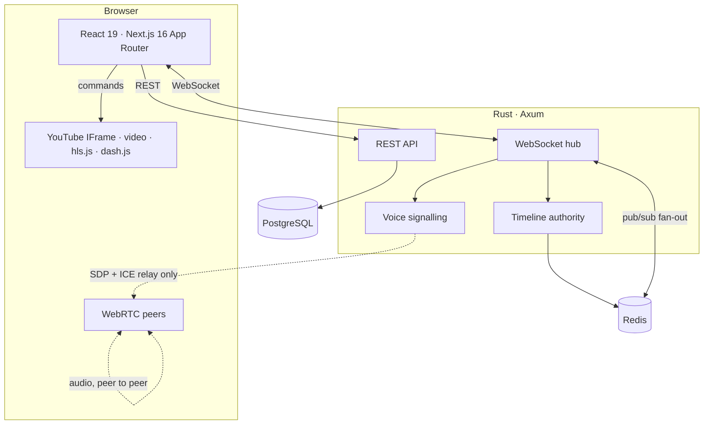

<div align="center">

# playercn

**Watch anything together, actually in sync.**

Create a room, share one link, and everyone lands on the same frame — YouTube,
direct video and audio files, HLS and DASH streams, and whole M3U/PLS
playlists. With voice chat, a shared queue and live chat. No account needed to
join.

<br />


</div>

> [!NOTE]
> The test-count badges are static and reflect a local run, not CI — there is no
> pipeline yet. Add a real status badge once `.github/workflows/ci.yml` exists;
> a green badge backed by nothing is worse than no badge.

---

## What this is

A watch-party platform built around one hard problem: keeping independent
YouTube players, on machines whose clocks disagree, within a perceptual
tolerance of each other. Everything else — chat, queue, voice, moderation — is
ordinary product work layered on top of that.

If you read one section, read [How synchronisation works](#how-synchronisation-works).

## Quick start

**Prerequisites:** Rust 1.90+, Node 22+, pnpm 11+, Docker.

```bash
git clone <repo> playercn && cd playercn

pnpm install
./scripts/gen-keys.sh          # Ed25519 keypair for signing access tokens
cp .env.example .env           # defaults work for local development

pnpm infra:up                  # Postgres + Redis
pnpm server:dev                # :8080 — migrations run automatically
pnpm dev                       # :3000
```

Open <http://localhost:3000>. Guest sign-in works immediately; Google sign-in
and video search need API credentials (both optional — see `.env.example`).

## Architecture at a glance



Two deployable containers. The Rust service is the only thing that writes to
Postgres and the only thing that decides playback state; the web app is a
rendering client with no privileged access and no database credentials.

Deeper detail — request sequences, per-component invariants, failure behaviour
and the security posture — lives in
**[docs/architecture.md](docs/architecture.md)**.

## The stack, and why

| Layer | Choice | Reasoning | Runner-up |
| --- | --- | --- | --- |
| Frontend | Next.js 16 App Router · React 19 | Real nested layouts, so the socket survives navigation, plus server components for the marketing surface. | TanStack Start |
| Backend | Rust · Axum · Tokio | No GC pause inside the tail latency of a sync correction. `enum` + exhaustive `match` makes an unhandled protocol variant a compile error. | Go |
| Database | PostgreSQL 17 · SQLx | Real concurrent writers, row locking for queue reorders, `jsonb` settings, partial indexes on the directory. We write SQL; no ORM. | SeaORM |
| Realtime | WebSocket, one per client | Universal proxy support, ordered and reliable. Multiplexes every concern over one connection. | WebTransport |
| Voice | Mesh WebRTC behind a port | One hop, no relay, no media egress cost, best privacy. Swappable for an SFU. | LiveKit |
| Auth | Custom OAuth + split-token JWT | The authority is Rust; a Node auth library would put session semantics in the layer that isn't the source of truth. | Better Auth |
| Client state | Zustand + TanStack Query | Socket messages arrive outside React and must write to a store imperatively — Zustand's `setState` is first-class for that. | Jotai |
| Styling | Tailwind 4 · shadcn/ui (Base UI) · Lucide | v4 keeps tokens in CSS, which is what makes twelve themes and per-room appearance a runtime attribute swap rather than a rebuild. | Panda CSS |
| Playback | Engine per source kind behind one interface | The drift-correction loop is written once against `PlayerEngine`; supporting a new format is a new adapter, not a change to sync. | One player per page |
| Scaling | Redis leases, no sticky sessions | Exactly one node owns a room's timeline; any node can serve its sockets. | Sticky LB |

### Decisions that deviate from the original brief

**Next.js instead of Astro.** Astro is genuinely the better tool for the
marketing surface and would win a Lighthouse contest outright. It is the wrong
tool for the room: island boundaries fragment a store that four panels must read
frame-consistently, and there is no layout-route concept to keep a
`RTCPeerConnection` or a reconnecting socket alive across navigation. Running
both (Astro for marketing, an SPA for the app) was considered and rejected — two
pipelines, two containers and a duplicated design system to save ~40 kB on one
page. *This is the closest call in the document; SvelteKit and Solid both beat
React on the 60 Hz render path, and were rejected on ecosystem depth, not merit.*

**Custom OAuth instead of Better Auth / Auth.js / Clerk.** The first two are
Node-runtime libraries, so adopting one means the frontend server issues
sessions the Rust service must independently re-verify — two implementations of
session semantics, in two languages, that can disagree. Clerk is excellent but
prices per MAU, and this product's dominant user is an anonymous guest. The
actual scope is one provider and an authorization-code flow with PKCE.

**Mesh WebRTC instead of an SFU by default.** At Opus 32 kbps a full mesh costs
each peer `n−1` uploads: fine at 4, ~224 kbps at 8, unusable by 16. But a
watch-together room is a friend group, not a conference. Mesh is the default
because it needs zero extra infrastructure and media never touches our servers;
the voice layer is a port with LiveKit as the documented scale-out adapter,
selected by `VOICE_BACKEND`.

**No `youtube.readonly` scope, despite the brief inviting YouTube account
integration.** Reading someone's subscriptions pushes the consent screen into a
restricted tier requiring annual third-party security assessment, and asks
people to hand over their YouTube library to watch a video with friends. Public
video data is fetched server-side with our own API key, which serves the same
product need with none of the exposure. Scopes requested: `openid email profile`.

**No `packages/ui`.** A shared component package with exactly one consumer is
speculative generality — a build step, a versioning question and an import
indirection in exchange for nothing. It gets extracted the day a second consumer
exists.

## How synchronisation works

The naive implementation — host emits `pause`, everyone calls `pauseVideo()` —
fails at every real network delay: the event arrives after a variable delay so
its timestamp is already stale, there is no correction loop so drift accumulates
unbounded, and a late joiner has no way to derive the current position at all.
It looks correct on localhost and falls apart at 200 ms RTT.

**1. The timeline is state, not a command stream.** The server holds one record
per room:

```rust
struct Timeline {
    video_id:   Option<String>,
    anchor_pos: f64,   // position that was true …
    anchor_at:  i64,   // … at this server instant
    rate:       f64,
    paused:     bool,
    version:    u64,   // monotonic; clients reject anything older
}
```

Position is **derived**, never stored: `anchor_pos + (now − anchor_at) × rate`.
A client that joins an hour late computes the same answer as one that has been
there since the start — there is no catch-up path because there is nothing to
catch up to. `version` is a Lamport-style counter, so a delayed packet or two
simultaneous hosts cannot roll the room backwards.

**2. Clocks are estimated, not assumed.** Cristian's algorithm over the socket:
8 probes at 250 ms on connect, then every 10 s. A 32-sample ring buffer,
samples above 1.5× the 20th-percentile RTT discarded (a slow round trip is a
noisy one), and the **median** of the survivors — one proxy-induced outlier must
not move the estimate. `performance.now()` throughout, so an NTP step on the
user's machine cannot corrupt it.

**3. Drift is walked off, not seeked away.**

| Drift | Action | Why |
| --- | --- | --- |
| < 50 ms | nothing | Below perception *and* below the IFrame API's own ~250 ms reporting resolution — acting here is oscillation |
| 50 ms – 1.5 s | ±5% playback-rate nudge | Below the threshold of audible pitch artefact; the player *walks* into place with no stutter |
| > 1.5 s | hard seek | Too far to walk; eat the rebuffer |

That middle band is why a well-synced room feels like nothing is happening. It
is the same technique live-streaming players use to manage latency against a
drifting buffer. Corrections are suppressed while the player is buffering, and
fine corrections are withheld until the clock estimate is confident — better
visibly unsynced for two seconds than converged onto a wrong clock.

**4. Clients send intents, never commands.** The server validates permission,
computes the new anchor against *its own* clock, bumps `version`, and broadcasts
the result. Even the host waits for the echo before its own player moves — so
nobody can desynchronise the room by lying about their position, and the host
does not get a privileged, divergent view.

**5. It is measured.** Clients report drift every 10 s; the server recomputes it
from the reported *position* against its own clock rather than trusting the
client's arithmetic, and exposes `ytroom_sync_drift_p95_ms`. **p95 below 150 ms**
is the SLO — a room that cannot hold it is a bug with evidence attached.

The decision logic is a pure function (`decideCorrection`) in
`packages/protocol`, exhaustively tested at every band and boundary without a
browser.

## Repository layout

```
apps/
  server/          Rust — the authority
    src/sync/      the timeline (pure, exhaustively tested)
    src/realtime/  protocol, room runtime, hub, relay, sockets
    src/auth/      OAuth, tokens, cookies
    src/rooms/     CRUD, directory, permission policy
    migrations/    forward-only SQL
  web/             Next.js 16 client (App Router)
    src/app/       routes: landing, directory, create, room
    src/realtime/  clock estimator, socket, player sync
    src/realtime/player/  one engine per source kind, one interface
    src/stores/    Zustand stores, one per bounded context
    src/lib/themes.ts     the theme registry (mirrors the server's allowlist)
packages/
  protocol/        wire contract — Zod schemas shared by both sides
infra/caddy/       reverse proxy for non-Dokploy deployments
docs/              architecture map and deployment runbook
```

## Commands

```bash
pnpm dev              # web client, :3000
pnpm server:dev       # Rust service, :8080
pnpm build            # production build
pnpm lint             # Biome across the JS side
pnpm typecheck        # TypeScript, strict
pnpm test             # JS tests
pnpm server:test      # Rust tests
pnpm server:lint      # clippy, warnings denied
pnpm infra:up         # Postgres + Redis
pnpm infra:reset      # …and wipe the volumes
```

## Deployment

Dokploy is the supported path and needs five environment variables. See
**[docs/deployment.md](docs/deployment.md)** for the walkthrough, scaling notes
and what to alert on.

```bash
docker compose -f docker-compose.prod.yml up -d
docker compose -f docker-compose.prod.yml up -d --scale server=3   # no sticky sessions needed
```

Scaling out needs no load-balancer configuration: each room's authoritative
timeline is owned by whichever node holds its Redis lease, and other nodes serve
their own sockets and forward mutating intents to the owner.

## Current state

Verified locally: **118 Rust tests** and **15 protocol tests** pass, `clippy
-D warnings` is clean, TypeScript typechecks under `strict` with
`noUncheckedIndexedAccess` and `exactOptionalPropertyTypes`, Biome is clean, and
both production builds succeed.

**Implemented end to end:** the sync engine and its client, rooms and
permissions, guest and Google auth, chat with mentions and pins, the shared
queue with drag-and-drop reordering, vote-skip, auto-advance, presence, the
public directory, rate limiting, audit logging, metrics, graceful drain, and the
full container/deploy story.

**Scaffolded but not finished** — stated plainly rather than buried:

- **Voice** — the server side is complete (signalling relay, perfect-negotiation
  roles, capacity, ICE issuance) and the protocol is defined, but the browser
  `RTCPeerConnection` controller is not written. **Voice does not work yet.**
- **No compile-time SQL verification.** `query_as!` needs a live database or a
  committed `.sqlx/` cache at build time; adopting it before CI has Postgres
  would mean `cargo check` fails on a fresh clone. Queries are runtime-bound via
  `FromRow` with column lists held in one `const` per table. Migration path: add
  Postgres to CI → `cargo sqlx prepare` → commit `.sqlx/` → convert file by file.
- **No integration or browser tests.** The pure logic is well covered; the wiring
  between it is not. Nothing has actually traversed the running system yet.
- **Not started:** admin dashboard, i18n beyond the token layer, achievements,
  scheduled rooms, GIF picker, PWA/offline caching.

## Licence

MIT.
