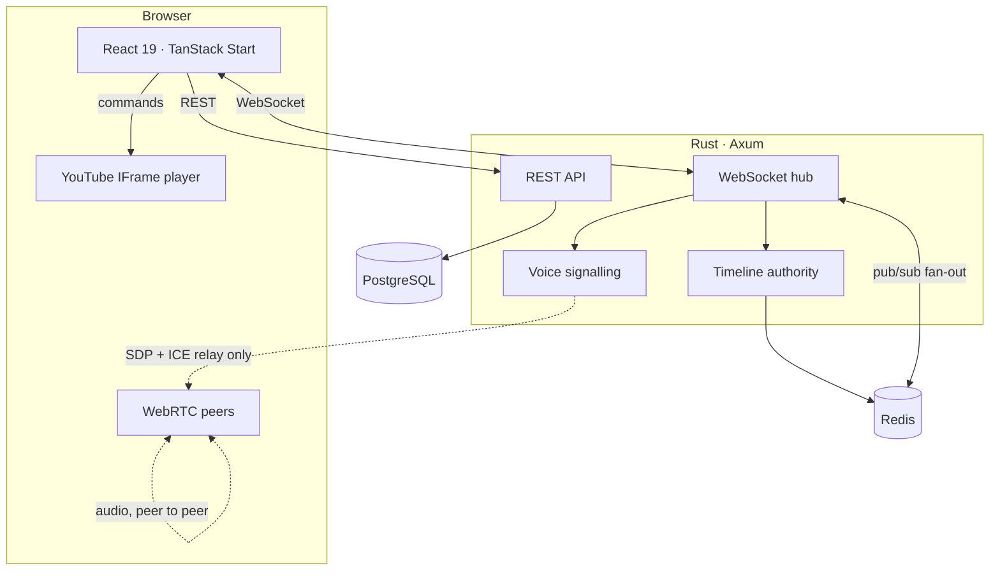

<div align="center">

# YouTube Room

**Watch YouTube together, actually in sync.**

Create a room, share one link, and everyone lands on the same frame — with
voice chat, a shared queue and live chat. No account needed to join.

</div>

---

## What this is

A watch-party platform built around one hard problem: keeping independent
YouTube players, on machines whose clocks disagree, within a perceptual
tolerance of each other. Everything else — chat, queue, voice, moderation — is
ordinary product work layered on top of that.

The synchronisation design is documented in detail in
**[ADR 0005](docs/adr/0005-video-synchronization.md)**, and it is the thing
worth reading first.

## Quick start

**Prerequisites:** Rust 1.90+, Node 22+, pnpm 11+, Docker.

```bash
git clone <repo> youtube-room && cd youtube-room

pnpm install
./scripts/gen-keys.sh          # Ed25519 keypair for signing access tokens
cp .env.example .env           # defaults work for local development

pnpm infra:up                  # Postgres + Redis
pnpm server:dev                # :8080 — migrations run automatically
pnpm dev                       # :3000
```

Open <http://localhost:3000>. Guest sign-in works immediately; Google sign-in
and video search need API credentials (both optional — see `.env.example`).

## Architecture at a glance



Two deployable containers. The Rust service is the only thing that writes to
Postgres and the only thing that decides playback state; the web app is a
rendering client with no privileged access.

| Layer     | Choice                                   | Why                                                    |
| --------- | ---------------------------------------- | ------------------------------------------------------ |
| Frontend  | TanStack Start · React 19 · Tailwind 4   | [ADR 0001](docs/adr/0001-frontend-framework.md) — real layout routes, so the socket survives navigation |
| Backend   | Rust · Axum · Tokio                      | [ADR 0002](docs/adr/0002-backend-runtime.md) — no GC in the tail latency of a sync correction |
| Database  | PostgreSQL 17 · SQLx                     | [ADR 0003](docs/adr/0003-database-and-query-layer.md)  |
| Realtime  | WebSocket, one per client                | [ADR 0004](docs/adr/0004-realtime-transport.md)        |
| Voice     | Mesh WebRTC behind an SFU-shaped port    | [ADR 0006](docs/adr/0006-voice-architecture.md)        |
| Auth      | Custom OAuth + split-token JWT           | [ADR 0007](docs/adr/0007-authentication.md)            |
| Scaling   | Redis leases, no sticky sessions         | [ADR 0010](docs/adr/0010-horizontal-scaling.md)        |

Every one of those links argues the case and names what was rejected. Three
deviate from the original brief: **TanStack Start instead of Astro**, **custom
OAuth instead of Better Auth**, and **mesh WebRTC instead of an SFU by
default**. The reasoning is in the ADRs.

## How synchronisation works

The naive implementation — host emits `pause`, everyone calls `pauseVideo()` —
fails at every real network delay. Instead:

**1. The timeline is state, not a command stream.** The server holds one record
per room:

```rust
struct Timeline {
    video_id:   Option<String>,
    anchor_pos: f64,   // position that was true …
    anchor_at:  i64,   // … at this server instant
    rate:       f64,
    paused:     bool,
    version:    u64,   // monotonic; clients reject anything older
}
```

Position is **derived**, never stored: `anchor_pos + (now − anchor_at) × rate`.
A client that joins an hour late computes the same answer as one that has been
there since the start — there is no catch-up path because there is nothing to
catch up to.

**2. Clocks are estimated, not assumed.** Cristian's algorithm over the socket,
32-sample ring buffer, high-RTT samples discarded, median of the survivors.
`performance.now()` throughout, so an NTP step on the user's machine cannot
corrupt the estimate.

**3. Drift is walked off, not seeked away.**

| Drift          | Action                    | Why                                     |
| -------------- | ------------------------- | --------------------------------------- |
| < 50 ms        | nothing                   | Below perception *and* below the player's own reporting resolution |
| 50 ms – 1.5 s  | ±5% playback-rate nudge   | Inaudible; the player *walks* into place with no stutter |
| > 1.5 s        | hard seek                 | Too far to walk; eat the rebuffer       |

That middle band is why a well-synced room feels like nothing is happening.

**4. Clients send intents, never commands.** Even the host waits for the
server's echo before its own player moves, so nobody can desynchronise the room
by lying about their position — and the host does not get a privileged,
divergent view.

**5. It is measured.** Clients report drift every 10 s; the server exposes
`ytroom_sync_drift_p95_ms`. **p95 below 150 ms** is the SLO, and a room that
cannot hold it is a bug with evidence attached.

## Repository layout

```
apps/
  server/          Rust — the authority
    src/sync/      the timeline (pure, exhaustively tested)
    src/realtime/  protocol, room runtime, hub, relay, sockets
    src/auth/      OAuth, tokens, cookies, permissions
    migrations/    forward-only SQL
  web/             TanStack Start client
    src/realtime/  clock estimator, socket, player sync
    src/stores/    Zustand stores, one per bounded context
packages/
  protocol/        wire contract — Zod schemas shared by both sides
infra/             Caddy config for non-Dokploy deployments
docs/adr/          why every choice was made
```

## Commands

```bash
pnpm dev              # web client, :3000
pnpm server:dev       # Rust service, :8080
pnpm build            # production build
pnpm lint             # Biome across the JS side
pnpm typecheck        # TypeScript, strict
pnpm test             # JS tests
pnpm server:test      # Rust tests
pnpm server:lint      # clippy, warnings denied
pnpm infra:up         # Postgres + Redis
pnpm infra:reset      # …and wipe the volumes
```

## Deployment

Dokploy is the supported path and needs five environment variables. See
**[docs/deployment.md](docs/deployment.md)** for the walkthrough, the scaling
notes, and what to alert on.

```bash
docker compose -f docker-compose.prod.yml up -d
docker compose -f docker-compose.prod.yml up -d --scale server=3   # no sticky sessions needed
```

## Current state

Verified locally: **118 Rust tests** and **15 protocol tests** pass, `clippy
-D warnings` is clean, TypeScript typechecks under `strict` with
`noUncheckedIndexedAccess` and `exactOptionalPropertyTypes`, Biome is clean, and
both production builds succeed.

**What is implemented end to end:** the sync engine and its client, rooms and
permissions, guest and Google auth, chat with mentions and pins, the shared
queue with drag-and-drop reordering, vote-skip, auto-advance, presence, the
public directory, rate limiting, audit logging, metrics, graceful drain, and
the full container/deploy story.

**What is scaffolded but not finished** — stated plainly rather than buried:

- **Voice** — the server side is complete (signalling relay, perfect-negotiation
  roles, capacity, ICE issuance) and the protocol is defined, but the browser
  `RTCPeerConnection` controller is not written. Voice does not work yet.
- **Compile-time SQL verification** — queries are runtime-bound; see
  [ADR 0003](docs/adr/0003-database-and-query-layer.md) for why and the
  migration path.
- **Not started:** admin dashboard, i18n beyond the token layer, achievements,
  scheduled rooms, GIF picker, PWA/offline caching, and an end-to-end browser
  test suite.

## Licence

MIT.
