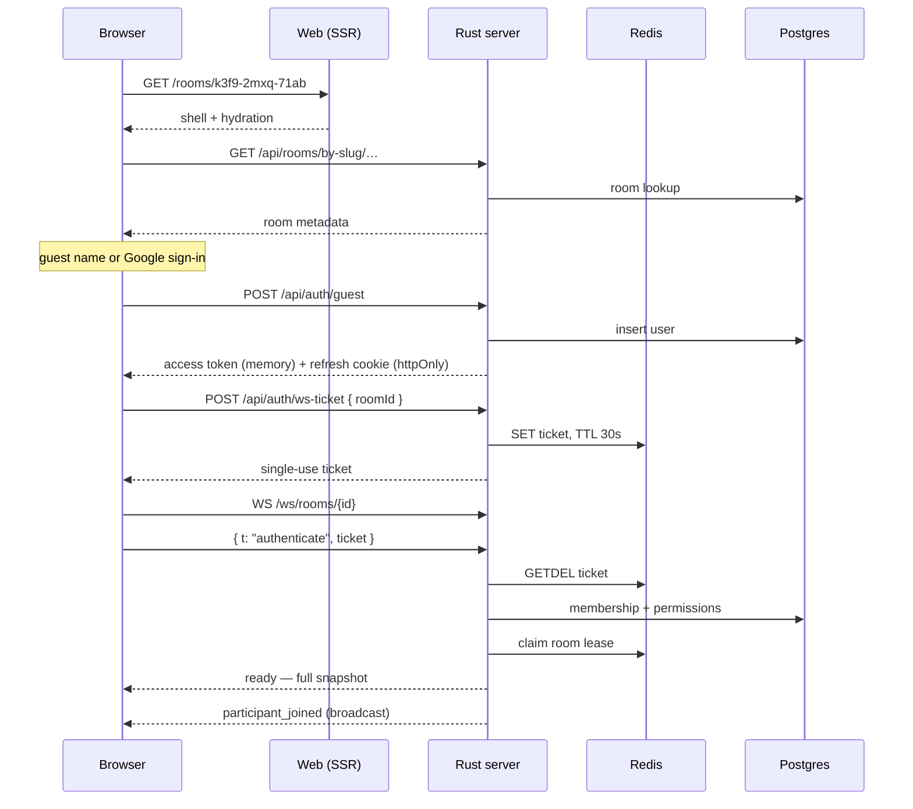
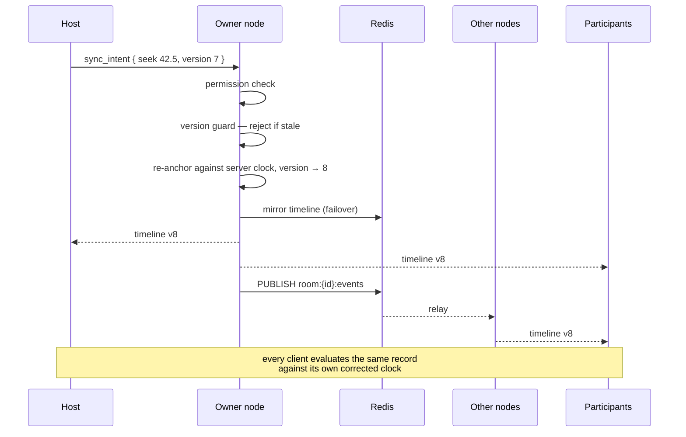

# Architecture

How the pieces fit together, and the invariants that must not be broken.
Individual decisions are argued in [`docs/adr/`](adr/); this document is the
map.

## The one rule

**The server owns the timeline. Everything else follows from that.**

A client renders and predicts. It never arbitrates. Every mutating action —
HTTP or socket — is validated server-side, applied against the server's own
clock, and broadcast as a new authoritative record. Even the host's own player
waits for the echo.

Break this and the product's core promise breaks with it.

## Request paths

### Joining a room

The ticket exists because a WebSocket cannot carry an `Authorization` header,
and a token in the query string lands in every access log on the path
([ADR 0007](adr/0007-authentication.md)).

### A playback intent

The initiator is not special. It receives the same broadcast as everyone else
and transitions on the same record — which is why a host on a slow connection
cannot drag the room out of step.

## Component responsibilities

| Component                     | Owns                                                | Must not                                  |
| ----------------------------- | --------------------------------------------------- | ----------------------------------------- |
| `sync/timeline.rs`            | The authoritative record and its arithmetic          | Do any I/O. It is pure, and that is what makes it exhaustively testable |
| `realtime/room.rs`            | Per-room participants, votes, local fan-out          | Touch the database                        |
| `realtime/hub.rs`             | Room registry, Redis leases, cross-node broadcast    | Apply intents — that is the session's job |
| `realtime/session.rs`         | Per-connection dispatch, permission checks           | Hold state that outlives the connection   |
| `realtime/relay.rs`           | Applying intents forwarded from other nodes          | Trust the forwarding node — it re-checks  |
| `realtime/autoadvance.rs`     | Advancing when a video ends                          | Run on a node that does not own the room  |
| `rooms/permissions.rs`        | The entire authorisation policy                      | Be bypassed by any handler                |
| `web/realtime/clock.ts`       | The offset estimate                                  | Use `Date.now()` for anything             |
| `web/realtime/use-player-sync.ts` | Driving the player toward the timeline           | Put the playback head in React state      |

## State: where each thing lives

| Data                  | Home       | Lifetime            | If lost                        |
| --------------------- | ---------- | ------------------- | ------------------------------ |
| Users, rooms, chat, queue | Postgres | Permanent           | Catastrophic — back this up    |
| Timeline (authoritative)  | Node memory | Room session     | Rehydrated from the Redis mirror |
| Timeline (mirror)     | Redis      | 6 h                 | Room restarts from idle        |
| Presence, votes, typing | Node memory | Connection        | Rebuilt on reconnect           |
| Room ownership lease  | Redis      | 30 s, renewed at 10 s | Another node claims the room |
| Rate-limit windows    | Redis      | 1 min               | Limits briefly reset           |
| Access token          | Browser memory | 15 min          | Silent refresh                 |
| Refresh token         | httpOnly cookie + hash in Postgres | 30 d | User signs in again |

Nothing a node holds is irreplaceable. That is what makes `--scale server=N`
and rolling deploys safe.

## Failure behaviour

Chosen deliberately, and each one is a trade rather than an oversight:

| Failure                | Behaviour                                     | Why                                                    |
| ---------------------- | --------------------------------------------- | ------------------------------------------------------ |
| Redis unreachable      | Rate limiters **fail open**; nodes assume local room ownership | A limiter that takes the product down is worse than the abuse it prevents. Single-node is the common deployment, so assuming local ownership is usually correct |
| Postgres unreachable   | Readiness fails; the node leaves the pool     | Without it we cannot authorise anything                 |
| Owner node dies        | Lease expires in ≤30 s; next node claims and rehydrates | Playback continues throughout — clients derive position from the record they already hold |
| Client falls behind    | Dropped after 256 queued messages             | Reconnect delivers a full snapshot, so disconnecting is cheap and a partial history is not |
| YouTube API down       | Queue-add still works with placeholder metadata | Never fail a user action because a third party is unwell |
| Clock estimate untrusted | Fine corrections suppressed                 | Better visibly unsynced for two seconds than converged onto a wrong clock |
| `SIGTERM`              | 503 first, wait, then release leases and close | Costs one reconnect instead of a dropped room          |

## Security posture

- **Authorisation is server-side, always.** Hidden UI is a rendering hint, not
  a control. Permissions are re-resolved per action, so a token minted before a
  demotion carries no stale authority.
- **Tokens are split.** Access tokens live in memory only (unreadable by XSS);
  refresh tokens are opaque, `httpOnly`, path-scoped, and rotated on every use
  with reuse detection that revokes the whole family.
- **User input reaches the database only through `.bind()`.** The handful of
  `AssertSqlSafe` call sites interpolate compile-time constants exclusively.
- **CSP is strict**, with a narrow allowance for the YouTube player and its
  image CDN — the one third-party surface we embed.
- **Rate limits are distributed** (Redis sliding windows), per-action and
  per-IP, so they hold across nodes.
- **Internal errors never reach the client.** They are logged with a request id
  and returned as an opaque 500. There is a unit test asserting a connection
  string cannot leak through the error type.
- **Guests are constrained by capability, not by suspicion:** they can join,
  talk, chat and queue, but cannot own rooms or hold moderator rights.

## Performance notes

The decisions that actually move the numbers:

- **Serialize once, send many.** A room broadcast is encoded to JSON once and
  shared as `Arc<str>`. The naive alternative does N identical serializations
  per event.
- **60 Hz values never enter React state.** The playback head and audio levels
  are written to refs and applied imperatively in `requestAnimationFrame`.
  In `useState` they would re-render chat, queue and the participant list sixty
  times a second.
- **Fractional queue positions.** A drag is one `UPDATE`, not a renumber of the
  tail, and concurrent drags cannot interleave into an order nobody asked for.
- **Partial indexes on the directory.** The hottest read never touches the long
  tail of private rooms.
- **Chat is virtualised**, so a three-hour room does not degrade as it fills.
- **Keyset pagination** for chat history — offset paging drifts as new messages
  arrive mid-scroll.
- **Video metadata is cached in Redis**, so forty people adding the same link
  costs one upstream call.

## Known gaps

Recorded here rather than discovered later:

1. **Voice has no client.** Server-side signalling is complete; the browser
   `RTCPeerConnection` controller is not written.
2. **No compile-time SQL verification** — see
   [ADR 0003](adr/0003-database-and-query-layer.md) for the reasoning and the
   migration path.
3. **No integration or browser test suite.** The pure logic is well covered;
   the wiring between it is not.
4. **Forwarded intents cannot reply.** A cross-node intent that fails produces
   no error for the originator. Permission is checked before forwarding, so
   this is rare — documented at `realtime/relay.rs`.
5. **The protocol contract test is not automated.** `packages/protocol` mirrors
   the Rust enums by hand; the sample-endpoint test described in
   [ADR 0011](adr/0011-monorepo-tooling.md) is not yet implemented.
